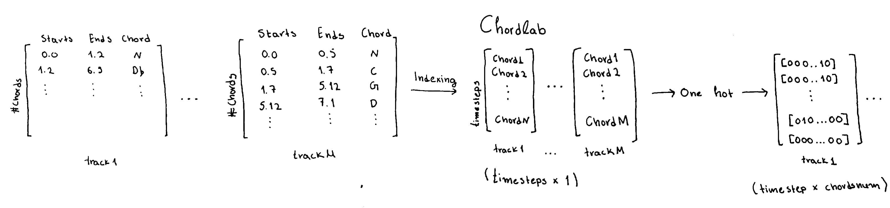
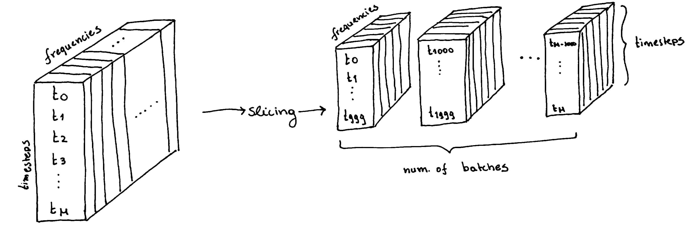

# Audio Chord Estimation

### Audio_Chord_Estimation.ipynb
* One Hot Encodings for Annotations
* Indexing on Annotations & Spectrograms

* Slicing & Padding

* tf.keras model
* predictions

### Annotation_Mapping.ipynb
Alternative representation from the 'one hot encodings' that required a lot of memory (RAM).
* Mapping <b>Chords to Notes</b> and <b>Notes to Chords</b>

### Chord_Embeddings.ipynb
* chord embeddings just like NLP -> <b>chords2vec</b>
