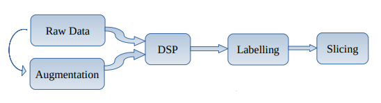
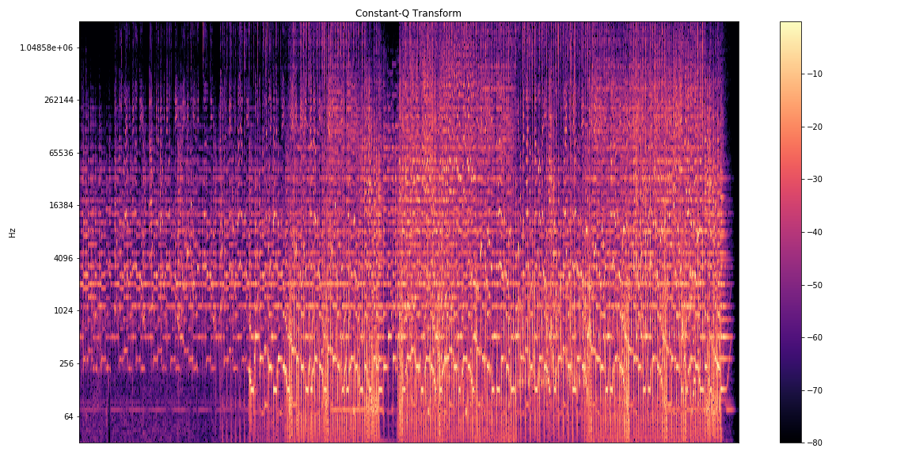
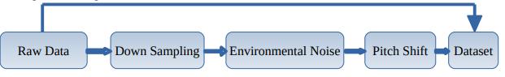
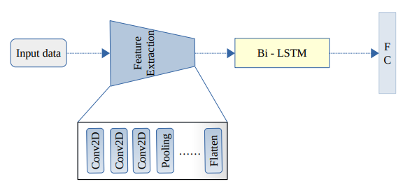
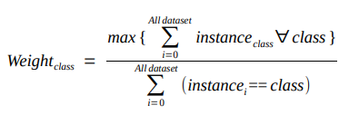
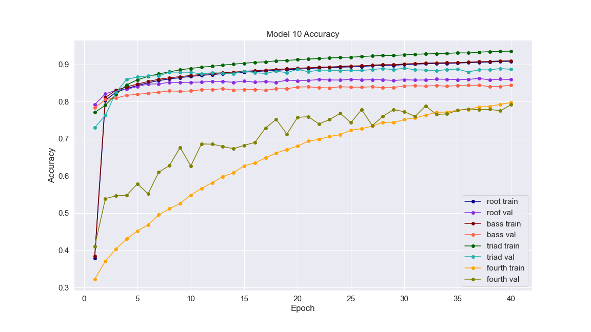
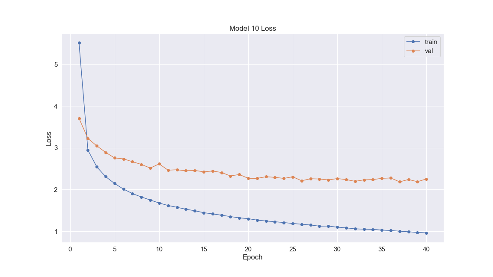

# Audio Chord Estimation

Audio chords are a fundamental piece of music and they are built over certain harmonic
rules, appearing appealing to the human ear. At the same time, deep learning is widely
known for it’s ability to discover non linear relationships on multi dimensional data. In this
thesis, through deep learning I will use models to aim and discover those relationships and
the point to that a neural network can learn some fundamental knowledge of music theory. 

## Introduction
This project focus on the exploration of various methods for each step of the process, including pre
processing, model architectures, training hyper parameters and post processing
techniques. There are some methods which helped improve the accuracy substantially,
and others that didn’t make a great impact on the result.

## Dataset
Isophonics dataset, created by Harte [3] providing 180 songs by The Beatles. The format of the data set, is 180 audio tracks on
mono .wav format at 44kHz sample rate, with their respective chord label files that have
the start and the end time of each chord appearance.

## Pre Processing

#### DSP
Constant Q transform with 192 frequency bins and 24 bins per octave

#### Data Augmentation

#### Chord Analysis

Non-popular modes appearances

## Model

**Model Architecture**

Convolutional layers will have the ability to map the spectrogram’s data into an
output vector, where this vector is going to be the input for the bidirectional LSTM layer
which will discover all the contextual information through time.
For the convolutions there are 2 different techniques that can be applied on audio.
• 1D Convolutions
• 2D Convolutions
Both techniques provide very good results, but they both have their differences.
First of all, 1D convolutions retain only the temporal layout of the spectrogram. On the
other hand 2D convolution layers, among the temporal layout, they also retain the
frequential layout, by giving attention to neighboring frequency bands. With that in mind,
means that the same filters will be applied on different frequency offsets. Thus, each
output vector will be a 2D feature map of the input spectrogram.
1D convolutions understand the difference between a regular image, and a spectrogram
and how different in context they are. They can learn and extract features, that they can
occur at any time. But, 2D convolutions, not only learn features can occur at any time, but
they assume that they can occur at any frequency – pitch, shiftable across all the
frequency spectrum.
With all the above in mind, I designed the following network, consisting of 2D convolutions
as a feature extraction tool, in order to extract local features. The following recurrent layer,
will then have a chance to decode the features spanning across the time variable.

As it is evident from the data analysis done on chords, and confirmed by the training
process, most chord classes are under represented, a problem called imbalanced
classification. When the models sees 10K major chords but only 1000 minor chords it will
not be able to classify the minor chord as minor, and will label them as major.

Weight of class:

## Training

